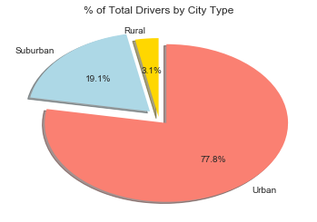

# **Observable trends**<br />
>**1. Drivers and rides are both the highest in urban city, high demand.**<br />
>**2. The fewer rides the higher average fare, especially in rural, maybe it's caused by more long distance travel and fewer daily commute.**<br />
>**3. The percentage of drivers, rides, fares are almost the same in all kinds of city, it's kind of a balanced condition.** 
<br />

```python
import matplotlib.pyplot as plt
import numpy as np
import pandas as pd
import os
```


```python
# Create DataFrame of city_data
csvpath1 = os.path.join('raw_data', 'city_data.csv')
csvdata1 = pd.read_csv(csvpath1)
csvdata1 = csvdata1.drop_duplicates('city', keep='last')
csvdata1.loc[csvdata1['city']=='Port James','driver_count'] = 18

# Create DataFrame of ride_data
csvpath2 = os.path.join('raw_data', 'ride_data.csv')
csvdata2 = pd.read_csv(csvpath2)

# Merge 2 tables
city_merge = pd.merge(csvdata2, csvdata1, on='city', how='outer')
city_merge.head()
```


<div>
<style>
    .dataframe thead tr:only-child th {
        text-align: right;
    }

    .dataframe thead th {
        text-align: left;
    }

    .dataframe tbody tr th {
        vertical-align: top;
    }
</style>
<table border="1" class="dataframe">
  <thead>
    <tr style="text-align: right;">
      <th></th>
      <th>city</th>
      <th>date</th>
      <th>fare</th>
      <th>ride_id</th>
      <th>driver_count</th>
      <th>type</th>
    </tr>
  </thead>
  <tbody>
    <tr>
      <th>0</th>
      <td>Sarabury</td>
      <td>2016-01-16 13:49:27</td>
      <td>38.35</td>
      <td>5403689035038</td>
      <td>46</td>
      <td>Urban</td>
    </tr>
    <tr>
      <th>1</th>
      <td>Sarabury</td>
      <td>2016-07-23 07:42:44</td>
      <td>21.76</td>
      <td>7546681945283</td>
      <td>46</td>
      <td>Urban</td>
    </tr>
    <tr>
      <th>2</th>
      <td>Sarabury</td>
      <td>2016-04-02 04:32:25</td>
      <td>38.03</td>
      <td>4932495851866</td>
      <td>46</td>
      <td>Urban</td>
    </tr>
    <tr>
      <th>3</th>
      <td>Sarabury</td>
      <td>2016-06-23 05:03:41</td>
      <td>26.82</td>
      <td>6711035373406</td>
      <td>46</td>
      <td>Urban</td>
    </tr>
    <tr>
      <th>4</th>
      <td>Sarabury</td>
      <td>2016-09-30 12:48:34</td>
      <td>30.30</td>
      <td>6388737278232</td>
      <td>46</td>
      <td>Urban</td>
    </tr>
  </tbody>
</table>
</div>


```python
# Total Number of Rides Per City
URide = city_merge.drop_duplicates(['ride_id'], keep='last')
Ride_city_group = URide.groupby('city')
RideCount = Ride_city_group['ride_id'].count()

# Total Number of Drivers Per City
ChangeIndex = csvdata1.set_index('city')
DriverCount = ChangeIndex['driver_count']

# Average Fare($) Per Ride Per City
city_group = city_merge.groupby('city')
AveFare = city_group['fare'].mean()

# Total Fare($) Per Driver Per City
TotalFare = city_group['fare'].sum()
DriverAve = TotalFare / DriverCount

# City Type(Urban, Suburban, Rural)
CityType = ChangeIndex['type']

# Create a DataFrame for all series of Data
Bubble_df = pd.DataFrame({'ave_fare_per_ride':AveFare, 'type':CityType, 'ride_count':RideCount, 'driver_count':DriverCount,
                          'ave_fare_per_driver':DriverAve})

Urban_df = Bubble_df[(Bubble_df['type'] == 'Urban')]
Suburban_df = Bubble_df[(Bubble_df['type'] == 'Suburban')]
Rural_df = Bubble_df[(Bubble_df['type'] == 'Rural')]

Bubble_df.head()
```


<div>
<style>
    .dataframe thead tr:only-child th {
        text-align: right;
    }

    .dataframe thead th {
        text-align: left;
    }

    .dataframe tbody tr th {
        vertical-align: top;
    }
</style>
<table border="1" class="dataframe">
  <thead>
    <tr style="text-align: right;">
      <th></th>
      <th>ave_fare_per_driver</th>
      <th>ave_fare_per_ride</th>
      <th>driver_count</th>
      <th>ride_count</th>
      <th>type</th>
    </tr>
  </thead>
  <tbody>
    <tr>
      <th>Alvarezhaven</th>
      <td>35.323333</td>
      <td>23.928710</td>
      <td>21</td>
      <td>31</td>
      <td>Urban</td>
    </tr>
    <tr>
      <th>Alyssaberg</th>
      <td>7.997761</td>
      <td>20.609615</td>
      <td>67</td>
      <td>26</td>
      <td>Urban</td>
    </tr>
    <tr>
      <th>Anitamouth</th>
      <td>20.990000</td>
      <td>37.315556</td>
      <td>16</td>
      <td>9</td>
      <td>Suburban</td>
    </tr>
    <tr>
      <th>Antoniomouth</th>
      <td>24.750000</td>
      <td>23.625000</td>
      <td>21</td>
      <td>22</td>
      <td>Urban</td>
    </tr>
    <tr>
      <th>Aprilchester</th>
      <td>8.523469</td>
      <td>21.981579</td>
      <td>49</td>
      <td>19</td>
      <td>Urban</td>
    </tr>
  </tbody>
</table>
</div>


```python
plt.figure(figsize=(8, 8))
plt.style.use('seaborn-darkgrid')
Urban_handle = plt.scatter(Urban_df['ride_count'], Urban_df['ave_fare_per_ride'], s=Urban_df['ride_count']*20,
                           c='C1', label='Urban', alpha=0.5, edgecolors='black', linewidths=2)
Suburban_handle = plt.scatter(Suburban_df['ride_count'], Suburban_df['ave_fare_per_ride'], s=Suburban_df['ride_count']*20,
                              c='C0', label='Suburban', alpha=0.5, edgecolors='black', linewidths=2)
Rural_handle = plt.scatter(Rural_df['ride_count'], Rural_df['ave_fare_per_ride'], s=Rural_df['ride_count']*20, 
                           c='C8', label='Rural', alpha=0.5, edgecolors='black', linewidths=2)

plt.title('Pyber Ride Sharing Data(2016)')
plt.xlabel('Total Number of Rides(Per City)')
plt.ylabel('Average Fare($)')

plt.legend(handles=[Urban_handle, Suburban_handle, Rural_handle], loc='best', title='City Types', markerscale=0.5,
           fontsize='large')
plt.xlim(0, 35)
plt.ylim(15, 55)
plt.show()
```


```python
plt.figure(figsize=(8, 8))
plt.style.use('seaborn-darkgrid')
Urban_handle = plt.scatter(Urban_df['driver_count'], Urban_df['ave_fare_per_driver'], s=Urban_df['driver_count']*20,
                           c='C1', label='Urban', alpha=0.5, edgecolors='black', linewidths=2)
Suburban_handle = plt.scatter(Suburban_df['driver_count'], Suburban_df['ave_fare_per_driver'], s=Suburban_df['driver_count']*20,
                              c='C0', label='Suburban', alpha=0.5, edgecolors='black', linewidths=2)
Rural_handle = plt.scatter(Rural_df['driver_count'], Rural_df['ave_fare_per_driver'], s=Rural_df['driver_count']*20, 
                           c='C8', label='Rural', alpha=0.5, edgecolors='black', linewidths=2)

plt.title('Pyber Driver Sharing Data(2016)')
plt.xlabel('Total Number of Drivers(Per City)')
plt.ylabel('Average Fare($)')

plt.legend(handles=[Urban_handle, Suburban_handle, Rural_handle], loc='best', title='City Types', markerscale=0.5,
           fontsize='large')

plt.xlim(0, 80)
plt.ylim(-100, 800)
plt.show()
```


```python
Pie_1_df = city_merge.groupby('type')
FareCityType = Pie_1_df['fare'].sum()

Pie_2_df = Bubble_df.groupby('type')
RideCityType = Pie_2_df['ride_count'].sum()

DriverCityType = Pie_2_df['driver_count'].sum()

explode = [0, 0.1, 0.1]
colors = ['gold', 'lightblue', 'salmon']
labels = ['Rural', 'Suburban', 'Urban']
```


```python
plt.pie(FareCityType, explode=explode, colors=colors, labels=labels, autopct="%1.1f%%", shadow=True, startangle=90)
plt.title('% of Total Fares by City Type')
plt.show()
```


```python
plt.title('% of Total Rides by City Type')
plt.pie(RideCityType, explode=explode, colors=colors, labels=labels, autopct="%1.1f%%", shadow=True, startangle=90)
plt.show()
```


```python
plt.title('% of Total Drivers by City Type')
plt.pie(DriverCityType, explode=explode, colors=colors, labels=labels, autopct="%1.1f%%", shadow=True, startangle=90)
plt.show()
```




